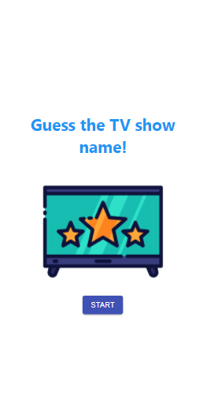
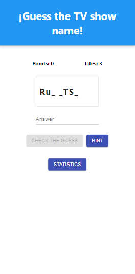

# ✨ ZEEKIT CODING CHALLENGE 

## 🎨 Preview




[DEMO](https://nicolezimerman.github.io/zeekit-challenge/)

## 💻 Technology

HTML, CSS, REACTJS, TYPESCRIPT

## 🚀 Installation

1. Clone project
2. Install the dependencies

```bash
npm install
```

## ⚙️ Usage

1. Go to project directory on the shell cd zeekit-challenge
2. Run on the local host npm start This will be open on [http://localhost:3000]

```bash
npm start
```

## ⚙️ Test

1. Go to project directory on the shell cd zeekit-challenge
2. Run the following command

```bash
npm test
```
